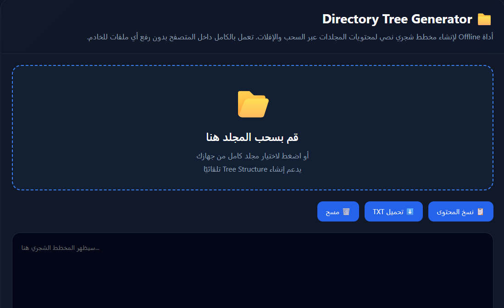
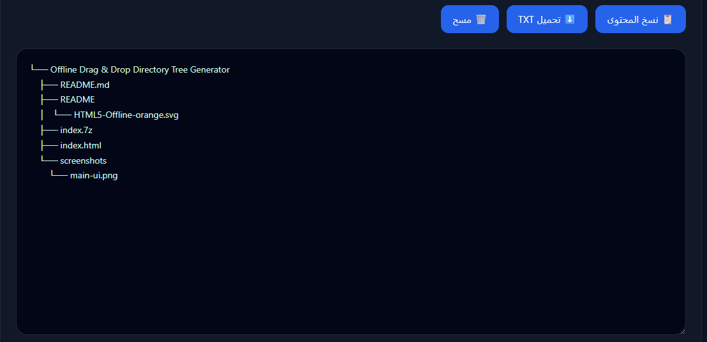

## ✨ المميزات

- يعمل بالكامل بدون إنترنت
- دعم السحب والإفلات للمجلدات
- إنشاء مخطط شجري نصي تلقائيًا
- نسخ المحتوى للحافظة
- تحميل النتيجة كملف TXT
- واجهة حديثة Responsive
- خفيف وسريع
- بدون Backend أو قواعد بيانات
- يدعم المجلدات المتداخلة
- متوافق مع أغلب المتصفحات الحديثة

---

## 📦 المتطلبات

لا يحتاج تثبيت أو إعدادات خاصة.

فقط متصفح حديث مثل:

- Google Chrome
- Microsoft Edge
- Brave
- Opera

> قد تكون بعض خصائص Drag & Drop محدودة في Firefox وSafari.

---

## 🚀 طريقة الاستخدام

### 1. حفظ الملف

احفظ المشروع باسم:

```text
index.html
```

---

### 2. فتح الأداة

قم بفتح الملف مباشرة داخل المتصفح.

---

### 3. سحب المجلد

قم بسحب أي مجلد داخل نافذة الأداة.

سيتم إنشاء Tree Structure تلقائيًا.

---

## 📋 مثال على النتيجة

```text
project/
├── assets/
│   ├── logo.png
│   └── style.css
├── index.html
└── script.js
```

---

## 🖼️ صور توضيحية

### الواجهة الرئيسية



---

### مثال على المخرجات



---

## 🔒 الخصوصية

الأداة تعمل بالكامل داخل المتصفح.

- لا يتم رفع الملفات
- لا يوجد اتصال بخادم خارجي
- لا يوجد تتبع
- لا يتم تخزين البيانات

جميع ملفاتك تبقى على جهازك فقط.

---

## 🛠️ التقنيات المستخدمة

- HTML5
- CSS3
- JavaScript
- File API
- Drag & Drop API

---

## 📄 الترخيص

MIT License

متاح للاستخدام الشخصي والتجاري.
